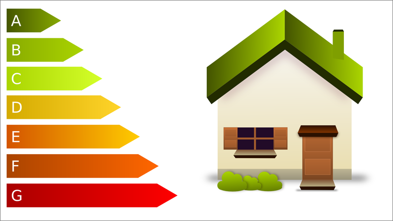
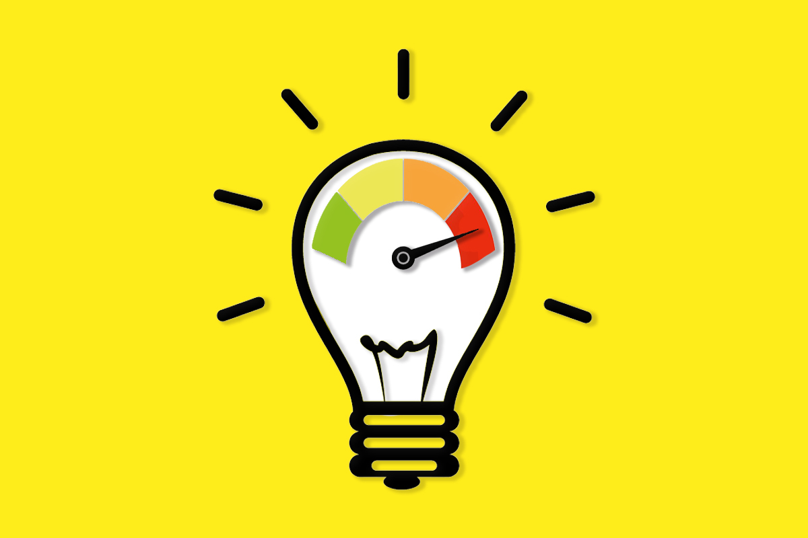

# Consumo del aula

1. [Tabla de consumo](#tabla-de-consumo)
- 1.1. [Consumo más alto](#consumo-mas-alto)
- 1.2. [Consumo en reposo](#consumo-en-reposo)
2. [Analizando el entorno](#analizando-el-entorno)
3. [Buenas prácticas](#buenas-prácticas)
4. [Renovación de equipos](#renovación-de-equipos)
5. [Conclusiones](#conclusiones)

## Tabla de consumo
| Elemento          | Consumo Reposo | Consumo en Carga de Trabajo |
|-------------------|----------------|-----------------------------|
|Aire Acondicionado | 150 W          | 1 - 3,5 kW                  |
|Calefacción        | 50 W           | 1,5 - 2 kW                  |
|Pantalla  grande   | 10 W           | 650 W                       |
|Fuente Alimentación| 10 W           | 250 - 400 W                 |
|CPU                | 30 W           | 117 W                       |
|Switch Huawei      | 20 W           | 50 W                        |
|Alumbrado          | SIN CONSUMO    | 40 W                        |
|Monitor            | 5 W            | 40 W                        |
|Altavoces          | 3 W            | 35 W                        |
|MikroTik           | 5 W            | 12 W                        |
|Wifi Aruba         | 5 W            | 12 W                        |
|Luz de Emergencia  | SIN CONSUMO    | 8 W                         |
|NVME               | 2 W            | 6 W                         |
|RAM                | 2 W            | 5 W                         |
|Teclado y ratón    | 1 W            | 2 W                         |
|T.Gráfica          | NO TIENE       | NO TIENE                    |

### Consumo mas alto:
- Monitor: Consumo aprox 40 W
- CPU: i5-12400 -> Consumo aprox: 117 W 
- NVME: Netac 512GB -> Consumo aprox: 6 W 
- RAM: 16GB DDR4 3200 MT/s 1.2V -> Consumo aprox: 5 W
- Pantalla grande: Q-Series de Newline -> Consumo aprox: 650 W

### Consumo en reposo:
- Monitor: Consumo aprox 5 W
- CPU: i5-12400 -> Consumo aprox: 30 W 
- NVME: Netac 512GB -> Consumo aprox: 2 W 
- RAM: 16GB DDR4 3200 MT/s 1.2V -> Consumo aprox: 2 W
- Pantalla grande: Q-Series de Newline -> Consumo aprox: 10 W

## Analizando el entorno

    Hay que tener en cuenta que esta tabla muestra un consumo aproximado <i>(puede que sea mas bajo o mas alto)</i>, por lo que no hay que tomarla como referencia exacta, si no un ejemplo que se acerca a lo que podría ser el consumo <b>INDIVIDUAL</b> de cada elemento eléctrico. No se multiplican factores como por ejemplo los teclados y ratones, solo se muestra el consumo de un teclado y un ratón, pero en el aula podrían haber <b>más de 20 de cada y eso sin contar las demás aulas, secretaría, sala de profesores, director, etc.</b>

    Si nos ponemos realistas, el consumo se <b>multiplicaria por varios números</b>, sin embargo es una información que no se puede proporcionar con exactitud y es mejor centrarnos en lo que sería nuestra aula.

## Buenas prácticas

    A la hora de hablar de eficiencia eléctrica nos referimos a las <b>técnicas que podemos emplear día a día para tener el menor consumo posible sin afectar el entorno</b> de trabajo o escuela en nuestro caso. Cosas como por ejemplo <u>apagar los equipos que no se usan</u>, <u>aprovechar la luz natural</u>, etc. He aquí una lista de cosas que se podrían poner en práctica para mejorar la eficiencia energética:

<ol>
    
        <li>
            <u>Apagar los equipos que no se usen</u> (ordenadores, monitores, proyectores, etc). <b>Ej: Hora del patio, salida del instituto.</b>
        </li>
         
        <li>
            <u>Aprovechar luz natural</u> (mantener cortinas abiertas y aprovechar la luz del día). <b>Si hace falta usar lámparas LED de bajo consumo.</b>
        </li>
         
        <li>
            <u>Regular el aire acondicionado y calefacción</u> (ajustar temperatura a valores razonables). <b>Evitar dejarlos encendidos en aulas vacías.</b>
        </li>
         
        <li>
            <u>Desconectar cargadores y fuentes de alimentación cuando no se usan</u> (podríamos desconectar los cargadores de portátiles, e incluso las fuentes de alimentación para que consuman menos).
        </li>
         
        <li>
            <u>Fomentar hábitos responsables entre alumnos y profesores</u> (crear conciencia sobre el uso de la energía: apagar luces al salir, no dejar equipos encendidos, informar sobre consumos excesivos, etc).
        </li>
         
        <li>
            <u><b>BONUS:</b></u> <u>Mantenimiento de quipos eléctricos:</u> filtros de aire, bombillas, conexiones en buen estado, uso de regleta con interrubpor, etc.
        </li>
         
    
</ol>

    Otra cosa importante a tener en cuenta es el <b>precio que puede tener la energía eléctrica</b>, dado a que hay diferentes <b>franjas horarias donde el precio sube o baja</b>, esto nos podría generar consciencia sobre el uso energético. Para más información, se puede consultar el <a href="https://tarifaluzhora.es/">precio de la electricidad en españa</a>.

## Renovación de equipos

    Como no sabemos exactamente todos los elementos como son, que modelo son, lo que gastan, etc. Vamos a comentar ciertos cambios que, si bien nos causará un gasto importante a la hora de renovar los elementos del aula, es verdad que también supondrá un menor gasto a largo plazo (hablando de consumo eléctrico).

<ul>
    
        <li>
            <u>Iluminación obsoleta:</u> Bombillas incandescentes o fluorescentes antiguas consumen bastante más que las <b>LED actuales</b>.
        </li>
         
        <li>
            <u>Sistemas de climatización ineficientes/antiguas:</u> Aires acondicionados y claefacciones antiguas suelen consumir mucha electricidad o gas porque <b>no tienen buena regulación</b>.
        </li>
         
        <li>
            <u>Mal aislamiento:</u> Si el edificio <b>no está bien aislado</b>, se pierde calor en invierno y frío en verano, lo que hace que la calefacción o el aire <b>trabajen más y gasten más energía</b>.
        </li>
    
</ul>

## Conclusiones

    Es importante revisar y ser consciente del consumo eléctrico que puede suponer un aula de informática como la nuestra. Cabe destacar que no es la única, sino que <b>habrá una, dos, cinco o incluso diez más</b>. Eso en un instituto normal y corriente, imaginemos por un momento una <b>universidad grande con varios grados</b>. Unas buenas prácticas puestas en marcha e inversiones en equipos con menos consumo pueden suponer grandes <b>beneficios a largo plazo</b>.

