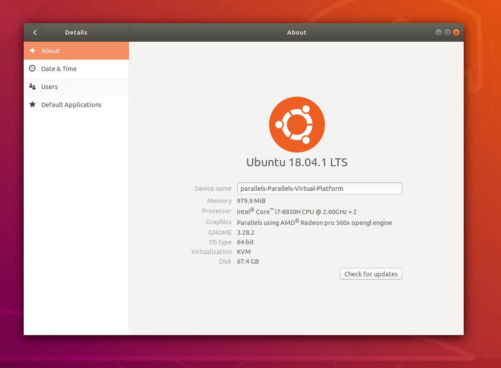
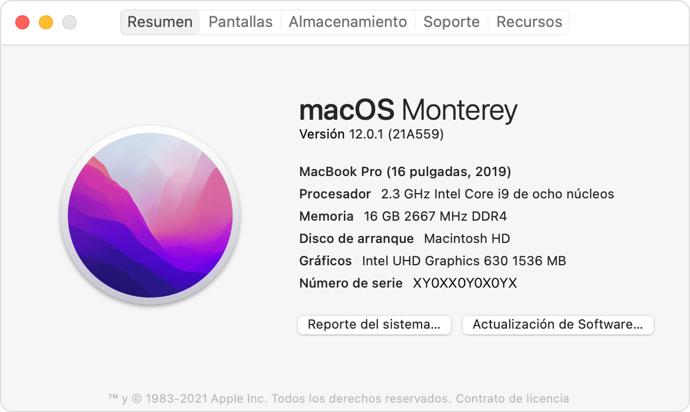
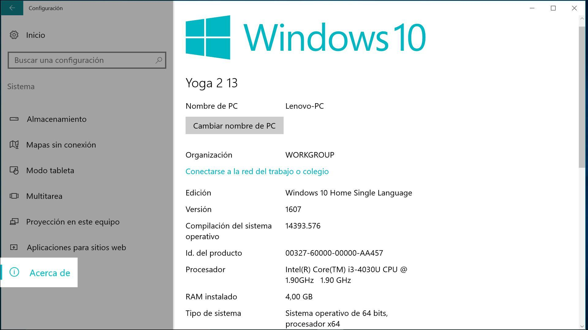

# Mi Entorno de Desarollo

### Índice
  1. [Inventario de Hardware y Software](#inventario-de-hardware-y-software)
  - 1.1. [Linux: Hardware en terminal](#linux-hardware-en-terminal)
  - 1.2. [Linux: Hardware en interfaz gráfica](#linux-hardware-en-interfaz-gráfica)
  - 1.3. [MacOS: Hardware en terminal](#macos-hardware-en-terminal)
  - 1.4. [MacOS: Hardware en interfaz gráfica](#macos-hardware-en-interfaz-gráfica)
  - 1.5. [Windows: Hardware en terminal EN POWERSHELL](#windows-hardware-en-terminal-en-powershell)
  - 1.6. [Windows: Hardware en interfaz gráfica](#windows-hardware-en-interfaz-gráfica)
  2. [Configuración y actualización](#configuración-y-actualización)
  3. [Sostenibilidad en el Desarollo](#sostenibilidad-en-el-desarollo)

</br>

## Inventario de Hardware y Software
<p style="text-align: justify">
    En muchas ocasiones, tanto por motivos técnicos como para saber la potencia de nuestro equipo, debemos de averiguar el hardware de nuestro dispositivo. No obstante hay varias maneras de saber el hardware instalado, tanto en SO Linux, macOS y Windows. De esta forma damos lugar a mi entorno de desarollo 
</p>
</br>

<p style="text-align: center; color: red">¡ATENCIÓN!</p>

<p style="text-align: justify">
    Nosotros vamos a centrarnos exclusivamente en terminal, por lo que enseñaremos comandos para cada SO y un resumen de rápida de como mirar todas estas características por interfaz gráfica.
</p>

---
### Linux: Hardware en terminal
<u>Modelo del equipo:</u>

```shell
sudo dmidecode -t system
```
</br>

<u>CPU:</u>

```shell
lscpu
```
</br>

<u>RAM:</u>

```shell
free -h
```
También sirve
```shell
sudo dmidecode -t memory
```

</br>

<u>Almacenamiento:</u>

```shell
sudo fdisk -l
```
</br>

<u>Tarjeta gráfica:</u>

```shell
lspci | grep -E "VGA|3D"
```

---
### Linux: Hardware en interfaz gráfica
<p style="text-align: justify">
    La manera principal de tener información simplificada sobre el sistema, es entrar en "Ajustes > Acerca de":
</p>



---
### MacOS: Hardware en terminal
<u>Modelo del equipo:</u>

```shell
system_profiler SPHardwareDataType | grep "Model Name"
```
</br>

<u>CPU:</u>

```shell
sysctl -n machdep.cpu.brand_string
```
</br>

<u>RAM:</u>

```shell
system_profiler SPHardwareDataType | grep "Memory"
```
</br>

<u>Almacenamiento:</u>

```shell
diskutil list
```
</br>

<u>Tarjeta gráfica:</u>

```shell
system_profiler SPDisplaysDataType
```

---
### MacOS: Hardware en interfaz gráfica
<p style="text-align: justify">
    Para acceder al "Acerca de" de MacOS, hacemos clic en el icono de Apple, seleccionamos "Acerca de este Mac" y saldrá nuestra ventana:
</p>



---
### Windows: Hardware en terminal EN POWERSHELL
<u>Modelo del equipo:</u>

```powershell
wmic csproduct get name
```
</br>

<u>CPU:</u>

```powershell
Get-CimInstance Win32_Processor | Select-Object Name
```
</br>

<u>RAM:</u>

```powershell
systeminfo | findstr /C:"Total Physical Memory"
```
</br>

<u>Almacenamiento:</u>

```powershell
Get-PhysicalDisk | Select-Object FriendlyName, MediaType, Size
```
</br>

<u>Tarjeta gráfica:</u>

```powershell
Get-CimInstance Win32_VideoController | Select-Object Name, AdapterRAM
```

---
### Windows: Hardware en interfaz gráfica
<p style="text-align: justify">
    Para acceder al "Acerca de" de Windows, debemos de hacer clic derecho al icono de Windows, y luego seleccionar "Sistema":
</p>




### Programas
<p style="text-align: justify">
    He aqui algunos de los programas que suelo utilizar en el día a dia
</p>

|        Mi entorno de desarollo       ||
|---------------------|-----------------|
|  Software y SO  | Windows 11 y Ubuntu |
|Entorno de Desarollo|Visual Studio Code|
|      Herramientas      |      Git     |
|  Lenguajes de programación  |  Python |
|     Bases de datos     |     MySQL    |


## Sostenibilidad en el Desarollo
<p style="text-align: justify">
    Hay que saber que el hecho de tener el sistema y los programas actualizados nos da una mejora de seguridad y de rendimiento. ¿Y esto por que? Bien pues digamos que con cada actualización que la desarolladora saca esta pensado para corregir errores. Es como si por ejemplo alguien crea un malware desconocido, ¿que va a pasar? Ese malware será peligroso hasta que los antivirus lo empiecen a detectar como malicioso, hasta entonces será una amenaza. Pues se podría decir que las actualizaciones hace esa función, arreglan los fallos de seguridad detectados. ¡Pero cuidado! ¡Que también pueden aparecer mas fallos!
</p>

<p style="text-align: justify">
    Aunque aparezcan mas fallos con las actualizaciones, si la desarolladora es profesional de verdad, normalmente suele traer más soluciones que problemas, o al menos previene los problemas probando sus propias actualizaciones. Por lo que no actualizar los sistemas operativos o programas deja de ser una opción confiable, ya que si, "no aparecen más vulnerabilidades", pero las que ya están se quedan hasta que cambies de versión.
</p>

<p style="text-align: justify">
    En el mundo del desarrollo de software, muchas veces nos centramos en codificar rápido y lanzar productos, pero pocas veces pensamos en el impacto ambiental de nuestro trabajo. La buena noticia es que con unos pequeños cambios, podemos hacer que nuestro día a día sea más sostenibles sin perder productividad.
</p>

<p style="text-align: justify">
    Un ordenador limpio y bien configurado consume menos recursos y, por tanto, menos energía.
</p>

<ul>
    <li>
        Actualiza tu software y librerías regularmente.
    </li>
    <li>
        Evita instalar programas innecesarios que corran en segundo plano.
    </li>
    <li>
        Aprovecha las funciones de ahorro de energía de tu sistema operativo.
    </li>
</ul>

<p style="text-align: justify">
        Pequeños ajustes, como cerrar procesos que no usas, pueden hacer una gran diferencia a lo largo del tiempo.
</p>

<p style="text-align: justify">
    Si trabajas con servidores o entornos virtuales, elige proveedores que tengan políticas verdes o data centers eficientes energéticamente. Evita dejar servicios corriendo sin necesidad y apaga instancias de prueba cuando no las uses. Cada microsegundo de CPU cuenta.
</p>

<p style="text-align: justify">
    <b>Cosas que podemos hacer ya de ya para mejorar la sostenibilidad:</b>
</p>

1. Limpieza automática de logs y archivos temporales. Evita acumular datos que ocupan espacio y requieren energía para almacenarse.

2. Usar entornos virtuales ligeros. Con herramientas como venv, pyenv o nvm, reduces duplicación de librerías y espacio en disco.

3. Optimización de recursos web y apps. Comprime imágenes, minimiza scripts y optimiza CSS para ahorrar ancho de banda y energía en servidores.

4. Documenta versiones y dependencias. Mantén un registro claro para evitar reinstalaciones y duplicación de librerías innecesarias.

5. Apaga o suspende máquinas virtuales y servidores locales cuando no se usen. Incluso unas pocas horas de ahorro diario pueden reducir significativamente tu consumo energético.